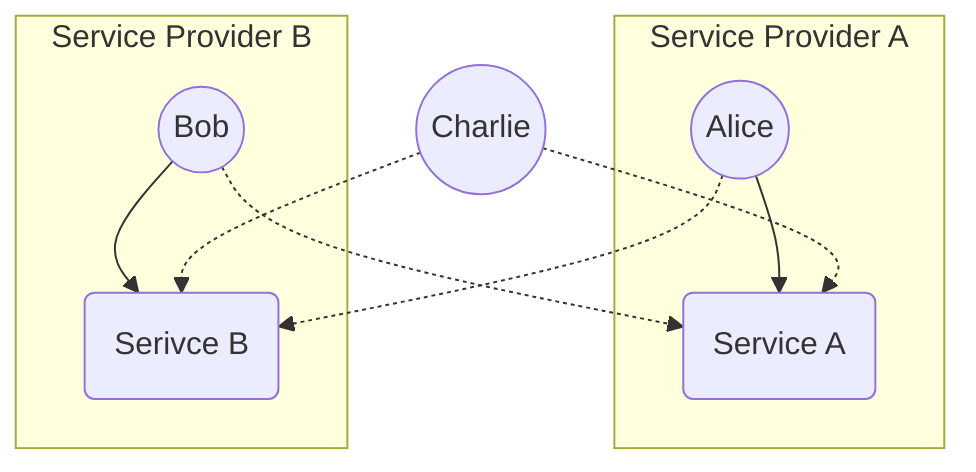

# Authorization Framework

- Users can be members of Service Providers

- Service Provider members can register and submit KPIs for services

- Users can see all service KPI measurements

::right::

<AdmonitionType type="important">
Service Providers can register multiple serivces.
</AdmonitionType>

