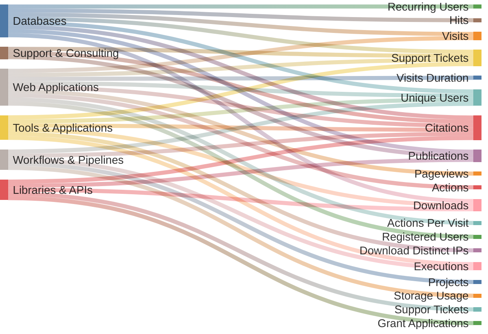

# KPI Necessities
<div class="flex flex-row gap-2">
    <div class="card denbi-category h-fit">
        <span class="font-semibold text-lg">Databases</span>
    </div>
    <div class="card h-fit w-1/2">
        <div class="flex flex-col gap-0">
            <span class="flex justify-left font-bold text-sm">Mandatory</span>
            <p class="flex flex-col text-gray-500 text-xs">
            <span class="flex justify-left">&#8594; #Visits</span>
            </p>
        </div>
        <div class="flex flex-col gap-0">
            <span class="flex justify-left font-bold text-sm">Recommended</span>
            <p class="flex flex-col text-gray-500 text-xs">
            <span class="flex justify-left">&#8594; #Recurring Users</span>
            <span class="flex justify-left">&#8594; #Support Tickets</span>
            <span class="flex justify-left">&#8594; #Unique Users</span>
            </p>
        </div>
        <div class="flex flex-col gap-0">
            <span class="flex justify-left font-bold text-sm">Optional</span>
            <p class="flex flex-col text-gray-500 text-xs">
            <span class="flex justify-left">&#8594; #Citations</span>
            <span class="flex justify-left">&#8594; #Downloads</span>
            <span class="flex justify-left">&#8594; #Hits</span>
            <span class="flex justify-left">&#8594; #Publications</span>
            </p>
        </div>
    </div>
</div>


<style>
    .card {
        @apply shadow p-4 text-center border border-gray-500 transition;
        background-color:rgb(240, 240, 240);
    }
    .denbi-category {
        border-width: 1px;
        border-style: solid;
        border-image: linear-gradient(to top right, #00ADEE, gray, #EB008B) 1;
    }
</style>

::right::

<br>
<br>

- **Mandatory KPI**
    - Indicators required by DFG

- **Recommended KPI**
    - Indicators relevant to most services of this category

- **Optional KPI**
    - Indicators useful to understand the impact of a service

---
layout: two-cols
layoutClass: gap-4
---

# KPI Set Definition

````md magic-move
```json
{
    "mandatory": [
        "Visits"
    ],
    "recommended": [
        "Recurring Users",
        "Support Tickets",
        "Unique Users"
    ],
    "optional": [
        "Citations",
        "Downloads",
        "Hits",
        "Publications"
    ]
}
```
```json
{
    "mandatory": [
        "Visits"
    ],
    "recommended": [
        "Recurring Users",
        "Support Tickets",
        "Unique Users"
    ],
    "optional": [
        "Citations",
        "Downloads",
        "Hits",
        "Publications",
        "Storage Usage"
    ]
}
```
````

::right::

<br>
<br>

