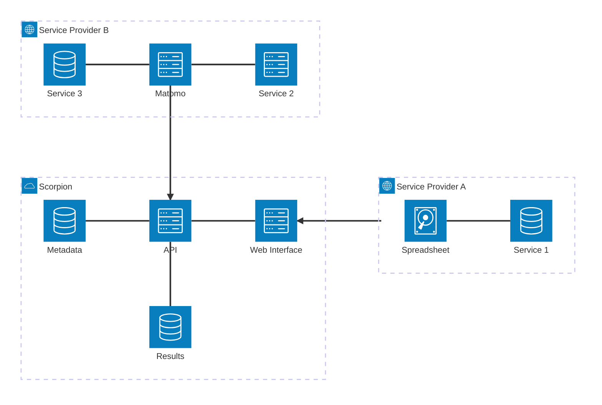

---

# Scorpion Architecture

<v-clicks>

- Heterogeneous service provider landscape

- Some use monitoring service (e.g. Matomo), others "count mails in a spreadsheet"

- Solution required to make this diverse reporting available to project management teams

</v-clicks>

