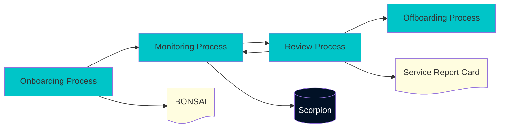
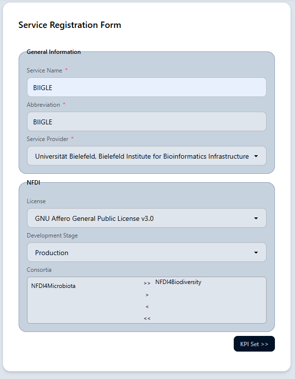
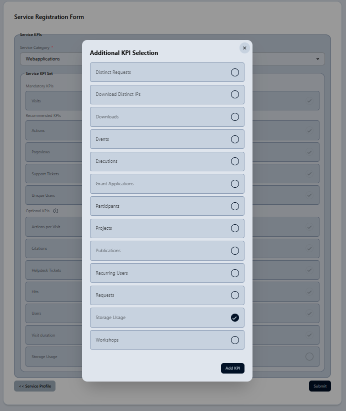
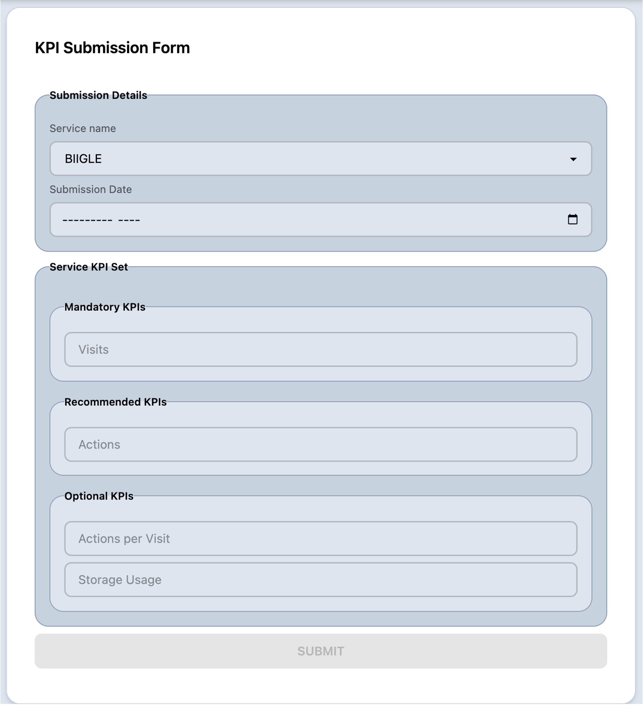
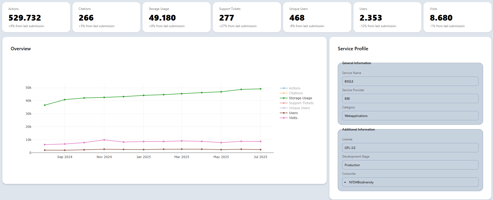
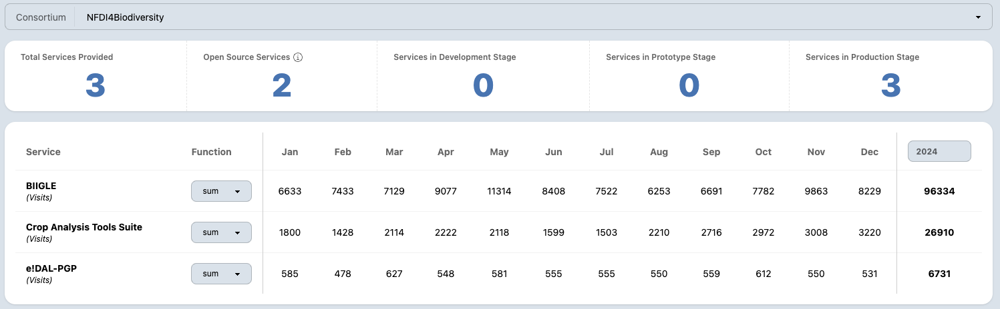

# Introducing Scorpion
## Harmonizing and Aggregating KPIs
## Across the NFDI Ecosystem

---
transition: slide-left
--- 

## 🦂 The Case of the Fragmented KPIs

Imagine you’re coordinating services across a service portfolio and management asks:

> <mdi-email-outline class="text-[#3AB9D5]"/> **"Can you show us last year's KPI measurements for the services of the service portfolio?"**

<div class="flex justify-between gap-4">
<div>

**But you realize:**

<ul class="flex flex-col gap-2">
    <li class="flex gap-2 items-center"><span class="w-6">🗂️</span> <span>KPI data is scattered across multiple providers</span></li>
    <li class="flex gap-2 items-center"><span class="w-6">📝</span> <span>Reporting form and schedules are inconsistent</span></li>
    <li class="flex gap-2 items-center"><span class="w-6">❓</span> <span>It’s unclear if the data is up-to-date</span></li>
</ul>
</div>

<div>

**What’s at stake?**

<ul class="flex flex-col gap-2">
    <li class="flex gap-2 items-center"><span class="w-6">⌛</span> <span>Delayed responses to reporting tasks</span></li>
    <li class="flex gap-2 items-center"><span class="w-6">📉</span> <span>Missed opportunities for improvement</span></li>
    <li class="flex gap-2 items-center"><span class="w-6">♻️</span> <span>Inefficient use of coordination resources</span></li>
</ul>

</div>
</div>

**How can we solve this recurring challenge?**

**In this session:**  
Discover how the **Scorpion** dashboard enables timely, harmonized, and actionable KPI insights for efficient service portfolio management.

--- 
transition: slide-left
layout: section
image: https://raw.githubusercontent.com/IPK-BIT/scorpion-slides/refs/heads/main/assets/undraw_features-overview.svg
---

# Scorpion
## KPI Dashboard

---
src: ../../pages/introduction/service_categories.md
transition: slide-left
---

---
src: ../../pages/framework/indicator_sets.md
transition: slide-left
---

---
transition: slide-left
layout: section
image: ./assets/live-demo.png
---

# Uses
## Actual Assessment

---
transition: slide-left
---

# Scorpion within the NFDI4Biodiversity Service Portfolio Management



---
transition: slide-left
layout: two-cols
layoutClass: gap-4
---

# Service Registration
<div>
    
</div>

::right::
<br>
<br>

<div class="flex flex-col gap-4 text-lg justify-center h-[27vh]">

<v-clicks>
<div>
<div class="flex items-center gap-2">
    <span class="i-mdi-information-outline text-[var(--slidev-primary)]" /> <b>General Metadata</b>
</div>
<div class="ml-6">
    <div class="flex items-center gap-2">
        <span class="i-mdi-rename-box text-[var(--slidev-accent)]" /> 
        Name
    </div>
    <div class="flex items-center gap-2">
        <span class="i-mdi-format-letter-case text-[var(--slidev-accent)]" /> 
        Abbreviation
    </div>
    <div class="flex items-center gap-2">
        <span class="i-mdi-domain text-[var(--slidev-accent)]" /> 
        Service Provider
    </div>
</div>
</div>

<div>
<div class="flex items-center gap-2 mt-4">
    <span class="i-mdi-database-lock-outline text-[var(--slidev-primary)]" /> <b>NFDI Specific Metadata</b>
</div>
<div class="ml-6">
    <div class="flex items-center gap-2">
        <span class="i-mdi-license text-[var(--slidev-accent)]" /> 
        License
    </div>
    <div class="flex items-center gap-2">
        <span class="i-mdi-progress-wrench text-[var(--slidev-accent)]" /> 
        Development Stage
    </div>
    <div class="flex items-center gap-2">
        <span class="i-mdi-account-group text-[var(--slidev-accent)]" /> 
        Consortia
    </div>
</div>
</div>
</v-clicks>

</div>


---
transition: slide-left
layout: two-cols
layoutClass: gap-4
---

# Service Registration

<div>
    
</div>
::right::
<br>
<br>
<br>
<br>

<div class="flex flex-col gap-4 text-lg justify-center h-[27vh]">

<v-clicks>
    <div>
        <div class="flex items-center gap-2">
            <span class="i-mdi-alert-circle-outline chart-bar text-[var(--slidev-primary)]" /> <b>Mandatory KPIs</b>
        </div>
        <div class="ml-6">
            <div class="flex items-center gap-2">
                <span class="i-mdi-lifebuoy text-[var(--slidev-accent)]" /> 
                Helpdesk Tickets
            </div>
            <div class="flex items-center gap-2">
                <span class="i-mdi-account text-[var(--slidev-accent)]" /> 
                Unique Users
            </div>
        </div>
    </div>
    <div>
        <div class="flex items-center gap-2">
            <span class="i-mdi-thumb-up-outline text-[var(--slidev-primary)]" /> <b>Recommended KPIs</b>
        </div>
        <div class="ml-6">
            <div class="flex items-center gap-2">
                <span class="i-mdi-flash text-[var(--slidev-accent)]" /> 
                Actions
            </div>
            <div class="flex items-center gap-2">
                <span class="i-mdi-eye text-[var(--slidev-accent)]" /> 
                Pageviews
            </div>
            <div class="flex items-center gap-2">
                <span class="i-mdi-ticket text-[var(--slidev-accent)]" /> 
                Support Tickets
            </div>
            <div class="flex items-center gap-2">
                <span class="i-mdi-walk text-[var(--slidev-accent)]" /> 
                Visits
            </div>
        </div>
    </div>
    <div>
        <div class="flex items-center gap-2">
            <span class="i-mdi-plus-box-outline text-[var(--slidev-primary)]" /> <b>Optional KPIs</b>
        </div>
        <div class="ml-6">
            <div class="flex items-center gap-2">
                <span class="i-mdi-flash-auto text-[var(--slidev-accent)]" /> 
                Actions per Visit
            </div>
            <div class="flex items-center gap-2">
                <span class="i-mdi-format-quote-close text-[var(--slidev-accent)]" /> 
                Citations
            </div>
            <div class="flex items-center gap-2">
                <span class="i-mdi-counter text-[var(--slidev-accent)]" /> 
                Hits
            </div>
            <div class="flex items-center gap-2">
                <span class="i-mdi-account-multiple text-[var(--slidev-accent)]" /> 
                Users
            </div>
            <div class="flex items-center gap-2">
                <span class="i-mdi-timer text-[var(--slidev-accent)]" /> 
                Visit Duration
            </div>
            <div class="flex items-center gap-2">
                <span class=" i-mdi-database text-[var(--slidev-secondary)]" /> 
                Storage Usage
            </div>
        </div>
    </div>
</v-clicks>

</div>

---
transition: slide-left
layout: two-cols
layoutClass: gap-4
---

# KPI Submission

<div>
    
</div>

::right::
<br>
<br>

````md magic-move
```py {*|3|4-12|13-17|*}
import requests

matomo_data = requests.post('https://matomo.org/index.p...
# Map Matomo indicator to Scorpion indicators
transformed_data = magic_function(matomo_data)
data=[]
for measurement in transformed_data:
    data.append({
        'kpi': measurment.name,
        'date': datetime.today.strftime('%Y-%m-%d')
        'value': measurement.value
    })
requests.post('https://scorpion.bi.denbi.de/nfdi/CATS', 
headers={
    'X-API-Key': 'TldrS3cr3tT0k4nglhf'
},
data=data)
```
```bash {*|1|2-20|21|*}
> pip install scorpion-submission-tool
> less .scorpion/config.toml
[[services]]
name = "edal-pgp"

[[services.matomo]]
module="API"
method="Actions.get"
site_id=15

[[services.matomo]]
module="API"
method="VisitsSummary.get"
site_id=15

[services.serpapi]
publications=[
    "e!DAL - a framework to store, share...", 
    ...
]
> scorpion-submission-tool -d lastMonth -p month
```
````

---
transition: slide-left
---

# Service Evaluation

<div>
    
</div>

---
transition: slide-down
---

# Service Porfolio Assessment

<div>
    
</div>

---
layout: end
---
