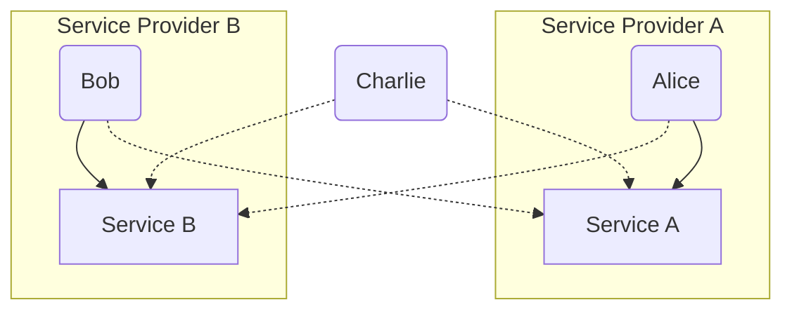
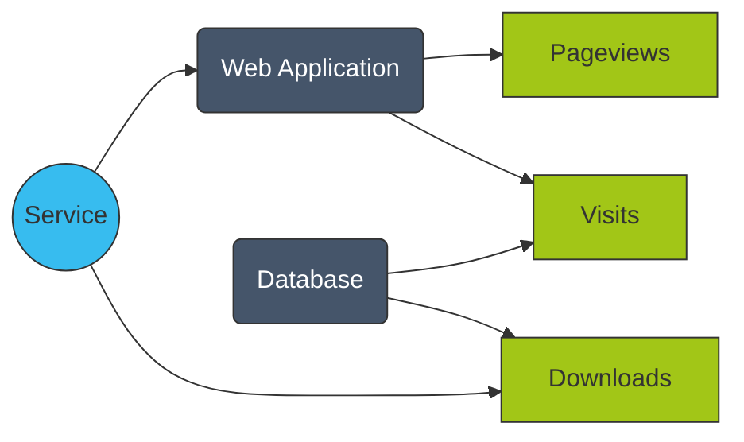
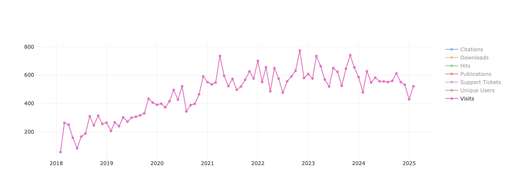

# Introducing Scorpion
## Harmonizing and Aggregating KPIs
## Across the NFDI Ecosystem


---
src: ../../pages/introduction/attention.md#2
transition: slide-left
---

---
hide: true
---

# Introduction
<ul style="display: flex; flex-direction: column; gap: 1.2em;">
<v-clicks>
    <li>
        <span class="font-bold text-[var(--slidev-accent)]">Rising demand:</span>
        In recent years, the need for quality and impact assessment in bioinformatics research has grown substantially, driven by expectations of funding agencies.
    </li>
    <li>
        <span class="font-bold text-[var(--slidev-accent)]">KPI monitoring as a solution:</span>
        Comprehensive Key Performance Indicator (KPI) monitoring has emerged as a critical component, enabling <span v-mark="{at: 2, color: 'var(--slidev-accent)', type: 'underline'}">objective assessment and transparent reporting</span> of service quality and impact.
    </li>
    <li>
        <span class="font-bold text-[var(--slidev-accent)]">Essential for large-scale networks:</span>
        Particularly in large-scale bioinformatics networks, KPI monitoring plays a vital role in reporting research results and outreach activities, directly informing stakeholders and funding bodies about the value and effectiveness of provided services.
    </li>
</v-clicks>
</ul>

---
hide: true
transition: slide-left
---

# The Challenge of KPI Monitoring

<ul style="display: flex; flex-direction: column; gap: 1.2em;">
<v-clicks>
    <li>
        <span class="font-bold text-[var(--slidev-accent)]">Fragmented practices:</span>
        Despite its importance, KPI monitoring is often limited by current practices.
    </li>
    <li>
        <span class="font-bold text-[var(--slidev-accent)]">Siloed data:</span>
        Service providers typically monitor their services in-house, leaving project management teams without direct access to up-to-date KPI measurements.
    </li>
    <li>
        <span class="font-bold text-[var(--slidev-accent)]">Manual processes:</span>
        KPI data is usually collected and managed via spreadsheets, which are later used for internal reporting and submission to stakeholders.
    </li>
    <li>
        <span class="font-bold text-[var(--slidev-accent)]">Inefficiency and risk:</span>
        This manual approach is time-consuming, error-prone, and impedes efficient project oversight.
    </li>
    <li>
        <span class="font-bold text-[var(--slidev-accent)]">Need for innovation:</span>
        The bioinformatics community increasingly recognizes the urgent need for an integrated, automated, and transparent KPI monitoring system to streamline and enhance data management and reporting.
    </li>
</v-clicks>
</ul>

---
layout: image-right
transition: slide-left
image: https://images.unsplash.com/photo-1644088379091-d574269d422f?q=80&w=1993&auto=format&fit=crop&ixlib=rb-4.1.0&ixid=M3wxMjA3fDB8MHxwaG90by1wYWdlfHx8fGVufDB8fHx8fA%3D%3D
---

# Objective

<ul style="display: flex; flex-direction: column; gap: 1.2em">
<v-clicks depth="2">
    <li>
        <span class="font-bold text-[var(--slidev-accent)]">Central dashboard:</span>
        Efficient, transparent collection and evaluation of KPIs in federated bioinformatics projects.
    </li>
    <li>
        <span class="font-bold text-[var(--slidev-accent)]">Comprehensive oversight & streamlined reporting:</span>
        Ensure comprehensive project oversight and streamlined reporting while retaining data sovereignty for service providers.
    </li>
    <li>
        <span class="font-bold text-[var(--slidev-accent)]">Mature service monitoring:</span> 
        Improve reporting quality, reduce manual workload, and enhance quality and impact assessment.
    </li>
</v-clicks>
</ul>

---
layout: section
transition: slide-left
image: ./assets/undraw_software-engineer.svg
---

# Method
## Concept and Framework

---
transition: slide-left
src: ../../pages/introduction/service_categories.md
---

<!-- # Laying the foundation
## Service monitoring within de.NBI/ELIXIR-DE
<br>
<div class="grid grid-cols-2 lg:grid-cols-3 gap-6">
    <div>
        <div class="card denbi-category">
            Databases
        </div>
        <div v-click="1" class="mt-2 text-center text-sm text-gray-600">
            <span class="inline-block align-middle mr-1">&#8594;</span>#Visits
        </div>
    </div>
    <div>
        <div class="card denbi-category">
            Tools & Application
        </div>
        <div v-click="1" class="mt-2 text-center text-sm text-gray-600">
            <span class="inline-block align-middle mr-1">&#8594;</span>#Downloads
        </div>
    </div>
    <div>
        <div class="card denbi-category">
            Support & Consulting
        </div>
        <div v-click="1" class="mt-2 text-center text-sm text-gray-600">
            <span class="inline-block align-middle mr-1">&#8594;</span>#Requests
        </div>
    </div>
    <div>
        <div class="card denbi-category">
            Libraries & APIs
        </div>
        <div v-click="1" class="mt-2 text-center text-sm text-gray-600">
            <span class="inline-block align-middle mr-1">&#8594;</span>#Downloads
        </div>
    </div>
    <div>
        <div class="card denbi-category">
            Web Applications
        </div>
        <div v-click="1" class="mt-2 text-center text-sm text-gray-600">
            <span class="inline-block align-middle mr-1">&#8594;</span>#Visits
        </div>
    </div>
    <div>
        <div class="card denbi-category">
            Workflows & Pipelines
        </div>
        <div v-click="1" class="mt-2 text-center text-sm text-gray-600">
            <span class="inline-block align-middle mr-1">&#8594;</span>#Executions    
        </div>
    </div>
</div>

<br>

- Service providers are responsible to measure KPIs and report them to the administration office

- Allows to perform a federated KPI monitoring with distributed service provider

<style>
.card {
    @apply shadow rounded p-4 text-center border border-gray-200 transition;
    background-color:rgb(240, 240, 240);
}

.denbi-category {
    border-width: 1px;
    border-style: solid;
    border-image: linear-gradient(to top right, #00ADEE, gray, #EB008B) 1;
}
</style> -->

<!--
- Comprehensive preliminary work within the German Network for Bioinformatics Infrastructure (de.NBI)
- Focused on establishing a structured approach to KPI management by categorizing services into distinct groups
- For each of these service categories, tailored KPI sets were defined in alignment with the overarching objectives of the respective services.
- To enhance clarity and encourage consistent reporting, KPIs within each set were classified according to their necessity: mandatory, recommended, or optional.
- This tiered structure ensured that critical usage metrics are consistently captured, while service providers retained flexibility to report additional relevant indicators where appropriate.
- Within this framework, the responsibility for collecting and reporting KPIs is delegated to the individual service providers.
- This decentralized approach promotes KPI data sovereignty, while also supporting harmonized project-wide monitoring and reporting.
-->
---
layout: two-cols
layoutClass: gap-4
transition: slide-left
---

# KPI Necessities
<div class="flex flex-row gap-2">
    <div class="card denbi-category h-fit">
        <span class="font-semibold text-lg">Databases</span>
    </div>
    <div class="card h-fit w-1/2">
        <div class="flex flex-col gap-0">
            <span class="flex justify-left font-bold text-sm">Mandatory</span>
            <p class="flex flex-col text-gray-500 text-xs">
            <span class="flex justify-left">&#8594; #Visits</span>
            </p>
        </div>
        <div class="flex flex-col gap-0">
            <span class="flex justify-left font-bold text-sm">Recommended</span>
            <p class="flex flex-col text-gray-500 text-xs">
            <span class="flex justify-left">&#8594; #Recurring Users</span>
            <span class="flex justify-left">&#8594; #Support Tickets</span>
            <span class="flex justify-left">&#8594; #Unique Users</span>
            </p>
        </div>
        <div class="flex flex-col gap-0">
            <span class="flex justify-left font-bold text-sm">Optional</span>
            <p class="flex flex-col text-gray-500 text-xs">
            <span class="flex justify-left">&#8594; #Citations</span>
            <span class="flex justify-left">&#8594; #Downloads</span>
            <span class="flex justify-left">&#8594; #Hits</span>
            <span class="flex justify-left">&#8594; #Publications</span>
            </p>
        </div>
    </div>
</div>


<style>
    .card {
        @apply shadow p-4 text-center border border-gray-500 transition;
        background-color:rgb(240, 240, 240);
    }
    .denbi-category {
        border-width: 1px;
        border-style: solid;
        border-image: linear-gradient(to top right, #00ADEE, gray, #EB008B) 1;
    }
</style>

::right::

<br>
<br>

- **Mandatory KPI**
    - Indicators required by DFG

- **Recommended KPI**
    - Indicators relevant to most services of this category

- **Optional KPI**
    - Indicators useful to understand the impact of a service

<!-- --- -->
<!-- transition: slide-left -->
<!-- --- -->

<!-- 
# Continuing the Work
## Service Monitoring in NFDI (& NFDI4Biodiversity)

<br>
<div class="grid grid-cols-2 lg:grid-cols-3 gap-6">
    <div>
        <div class="card nfdi-category">
            Data Curation
        </div>
        <div class="mt-2 text-center text-sm text-gray-600">
            <span class="inline-block align-middle mr-1">&#8594;</span>#Datasets Curated
        </div>
    </div>
    <div>
        <div class="card nfdi-category">
            Training
        </div>
        <div class="mt-2 text-center text-sm text-gray-600">
            <span class="inline-block align-middle mr-1">&#8594;</span>#Participants
        </div>
    </div>
    <div>
        <div class="card nfdi-category">
            Storage
        </div>
        <div class="mt-2 text-center text-sm text-gray-600">
            <span class="inline-block align-middle mr-1">&#8594;</span>#Storage Provided  
        </div>
    </div>
</div>

<br>

<v-clicks>

- DFG requires consortia to submit the DFG data sheet

- <span class="font-bold text-[var(--slidev-accent)]">Category concept more flexible:</span> Select a KPI set of a category, select additional KPIs to tailor KPI reporting to nature of the service

- Ensures comprehensive, adaptable and transparent KPI monitoring

</v-clicks>

<style>
    .card {
    @apply shadow rounded p-4 text-center border border-gray-200 transition;
    background-color:rgb(240, 240, 240);
}

.nfdi-category {
    border-width: 1px;
    border-style: solid;
    border-image: linear-gradient(to top right, #07C0F3, gray, #A0C80C) 1;
}
</style> 
-->

<!--
- Building on the foundation laid by de.NBI, the framework was subsequently adopted and expanded by the National Research Data Infrastructure (NFDI).
- The NFDI extension introduced new service categories to better capture the diversity of its activities, ensuring that each new category included at least one associated KPI.
- Notably, within the NFDI4Biodiversity consortium, the category "Training" was added to reflect the growing emphasis on education and capacity building.
- Alongside new categories, the necessity assignments of KPIs were revisited and updated to accommodate evolving project requirements.
- Moreover, the category concept itself is made more flexible in the NFDI context.
- Service providers are allowed to select additional KPIs from other categories, enabling them to tailor their KPI reporting to the full scope of their service offerings.
- This evolution of the framework ensures comprehensive, adaptable, and transparent KPI monitoring across federated research infrastructures.
-->

---
layout: section
transition: slide-left
image: ./assets/undraw_features-overview.svg
---

# Scorpion
## Dashboard & API

---
transition: slide-left
hide: true
---

# Platform Purpose and Scope

- Scorpion is developed as a central dashboard for federated KPI monitoring.
- Building directly on the established KPI framework, Scorpion is designed to support the evaluation of a broad and diverse service portfolio, addressing the complex requirements of federated research infrastructures.

---
transition: slide-left
layout: two-cols-header
layoutClass: gap-4
---

# Authentication, Authorization and User Management

- Scorpion integrates Life Science Login as AAI provider for general access control

::left::


<div class="auth-roles">
<v-clicks>
    <div class="role-group">
        <span class="role-title">Internal Authorization</span>
        Users are assigned to service provider groups.
                <ul>
                    <li>Register new services</li>
                    <li>Submit KPI measurements</li>
                </ul>
        Authenticated users can view results from all service providers.
    </div>
    <div class="role-group">
        <span class="role-title">Administrator Role</span>
        <ul>
            <li>Maintain the Scorpion instance</li>
            <li>Perform overall assessment of project</li>
        </ul>
    </div>
</v-clicks>
</div>

<style>
.auth-roles {
    display: flex;
    flex-direction: column;
    gap: 1em;
}
.role-group {
    background: #f7fafc;
    border: 1px solid #bbbbbbff;
    border-left: 4px solid var(--slidev-accent);
    padding: 1em 1.2em;
    border-radius: 0.5em;
    box-shadow: 0 1px 4px rgba(0,0,0,0.04);
}
.role-title {
    font-weight: 600;
    color: var(--slidev-accent);
    font-size: 1.1em;
    margin-bottom: 0.3em;
    display: block;
}
.role-group ul {
    margin: 0.2em 0 0 1em;
    padding: 0;
    list-style: disc;
}
.role-group ul ul {
    list-style: circle;
    margin-left: 1.2em;
}
</style>


::right::

<div class="flex flex-col gap-4">
<div class="flex justify-center">
    
</div>

<div class="flex justify-center">


</div>

<AdmonitionType v-click style="width: 100%" type="info">
Consortia are handled as special service providers, grouping services of different service providers.
</AdmonitionType>

</div>

---
transition: slide-left
layout: image-right
image: https://images.unsplash.com/flagged/photo-1567400358593-9e6382752ea2?q=80&w=1470&auto=format&fit=crop&ixlib=rb-4.1.0&ixid=M3wxMjA3fDB8MHxwaG90by1wYWdlfHx8fGVufDB8fHx8fA%3D%3D
---

# Service Registration

<v-clicks>

- Service registration includes essential metadata about the service
    - License
    - Project affiliation
    - Stage of development

- Metadata crucial for contextualization of impact assessment and project governance

- Besides metadata, registration includes KPI set definition

</v-clicks>

---
transition: slide-left
layout: two-cols
---

# KPI Set Definition
<br><br>
    


::right::

<div class="flex items-center justify-center h-full">
<table class="no-row-border">
    <tbody>
    <v-clicks>
        <tr>
            <td class="align-top pr-4">
                <mdi:shape class="text-3xl text-[var(--slidev-accent)]" />
            </td>
            <td>
                <span class="font-bold">Modular KPI Sets:</span>
                Scorpion enables modular definition of KPI sets for each service.
            </td>
        </tr>
        <tr>
            <td class="align-top pr-4">
                <mdi:web class="text-3xl text-[var(--slidev-accent)]" />
            </td>
            <td>
                <span class="font-bold">Web Submission:</span>
                Service providers can use the Web Form for monthly KPI Submission.
            </td>
        </tr>
        <tr>
            <td class="align-top pr-4">
                <mdi:api class="text-3xl text-[var(--slidev-accent)]" />
            </td>
            <td>
                <span class="font-bold">API Submission:</span>
                Service providers can use the Scorpion API to automate their Submission.
            </td>
        </tr>
    </v-clicks>
    </tbody>
</table>
</div>

<style>
.no-row-border tr {
    border-bottom: none !important;
}
</style>

<!-- --- -->
<!-- transition: slide-left -->
<!-- layout: image-left -->
<!-- image: https://images.unsplash.com/photo-1568952433726-3896e3881c65?q=80&w=1470&auto=format&fit=crop&ixlib=rb-4.1.0&ixid=M3wxMjA3fDB8MHxwaG90by1wYWdlfHx8fGVufDB8fHx8fA%3D%3D -->
<!-- --- -->

<!-- # KPI Submission

<!-- - For the submission of KPI measurements, users can report data via an intuitive web interface, ideal for manual monthly submissions, or utilize the REST API, which supports both monthly and daily submissions and enables automated reporting workflows.
- This dual reporting mechanism caters to the diverse technical capabilities and operational scales of different service providers. -->

<!-- <AdmonitionType type="important">
scorpion-submission-tool not yet published.
</AdmonitionType> -->

<!--
```bash {*|1|2-20|21|*}
> pip install scorpion-submission-tool
> less .scorpion/config.toml
[[services]]
name = "edal-pgp"

[[services.matomo]]
module="API"
method="Actions.get"
site_id=15

[[services.matomo]]
module="API"
method="VisitsSummary.get"
site_id=15

[services.serpapi]
publications=[
    "e!DAL - a framework to store, share...", 
    ...
]
> scorpion-submission-tool -d lastMonth -p month
```
 -->

---
transition: slide-left
---

# Analytical Capabilities and Reporting

<figure>
    
    <figcaption class="text-[#808080] font-thin text-sm italic">
        Development of the number of visits for e!DAL-PGP since January 2018.
    </figcaption>
</figure>

---
transition: slide-left
---

# Analytical Capabilities and Reporting

<figure>
    
    <figcaption class="text-[#808080] font-thin text-sm italic">
        DFG Indicator for selected services for the year 2024.
    </figcaption>
</figure>

<!-- 
- Scorpion’s analytical capabilities enable comprehensive performance evaluation.
- Services can be assessed both individually and in groups, offering flexible analysis tailored to different management and reporting requirements.
- For grouped analysis, Scorpion automatically aggregates mandatory KPIs across services to generate annual reports, supporting high-level project oversight and facilitating strategic decision-making to administrators.
- Individual analysis allows for in-depth assessment of specific services, helping service providers and review teams identify trends and areas for improvement. 
-->

---
transition: slide-left
---

# Conclusion

<div class="flex flex-col text-base leading-relaxed">
<v-clicks>

<!-- - <span class="font-bold text-[var(--slidev-accent)]">Scorpion</span> establishes a new benchmark for federated KPI monitoring in distributed bioinformatics projects.
- By offering a <span v-mark="{at: 2, color: 'var(--slidev-accent)', type: 'underline'}" class="font-semibold">central, transparent, and adaptable platform</span>, Scorpion overcomes challenges in assessing complex, multi-provider service portfolios.
- Its deployment in <span class="font-semibold text-[#61C634]">NFDI4Biodiversity</span> demonstrates practical value and acts as a <span v-mark="{at: 3, color: 'var(--slidev-accent)', type: 'underline'}" class="font-semibold">blueprint for future initiatives</span>.
- <span v-mark="{at: 4, color: 'var(--slidev-accent)', type: 'underline'}" class="font-semibold">Modular KPI definitions</span> and <span v-mark="{at: 4, color: 'var(--slidev-accent)', type: 'underline'}" class="font-semibold">streamlined reporting workflows</span> ensure both operational efficiency and strategic alignment.
- Integration with established authentication and authorization solutions enhances <span v-mark="{at: 5, color: 'var(--slidev-accent)', type: 'underline'}" class="font-semibold">data security and integrity</span>.
- Ongoing pilots in <span class="font-semibold text-[#225AA9]">de.NBI/ELIXIR-DE</span> and planned adoption by other NFDI consortia highlight Scorpion’s growing impact.
- Broad adoption underscores Scorpion’s potential to drive <span v-mark="{at: 7, color: 'var(--slidev-accent)', type: 'underline'}" class="font-semibold">transparency, efficiency, and robust impact assessment</span> across the bioinformatics community and beyond. -->

<div class="space-y-4">

<div>
<span class="font-bold text-[var(--slidev-accent)]">Back to Lena and Martin.</span> <span>Lena logs in to Scorpion, registers her service, configures the Submission Tool, and sees all her KPIs update automatically.
Martin opens the same dashboard and filters by service, service center, or time frame — no emails, no spreadsheets, no guesswork.</span>
</div>

<div>
<span class="font-bold text-[var(--slidev-accent)]">The next Monday.</span> <span> Lena enjoys her coffee while Scorpion syncs in the background.
Martin starts the KPI review with one click, confident that every number is up to date and traceable.</span>
</div>

</div>

<div>

<span class="font-bold text-[var(--slidev-accent)]">The Result:</span>
- Less overhead, fewer errors, faster decisions. A shared view of performance that turns KPI reporting from a burden into a strategic tool.
- Data transparency isn’t just about numbers — it’s about freeing people like Lena and Martin from chaos so they can focus on improving services, not chasing spreadsheets. 

</div>

</v-clicks>
</div>

---
layout: end
---

