# slidev-theme-scorpion

A Scorpion theme for [Slidev](https://github.com/slidevjs/slidev).

<!--
  Learn more about how to write a theme:
  https://sli.dev/guide/write-theme.html
--->

<!--
  run `npm run dev` to check out the slides for more details of how to start writing a theme
-->

<!--
  Put some screenshots here to demonstrate your theme

  Live demo: [...]
-->

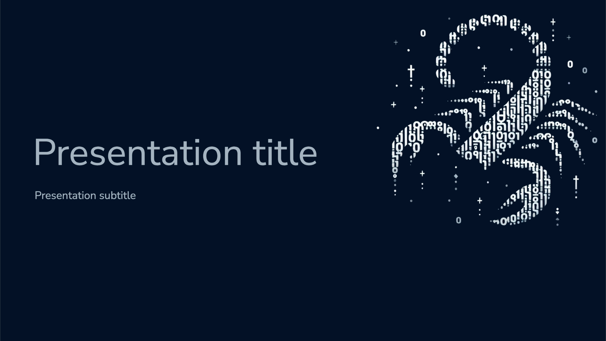
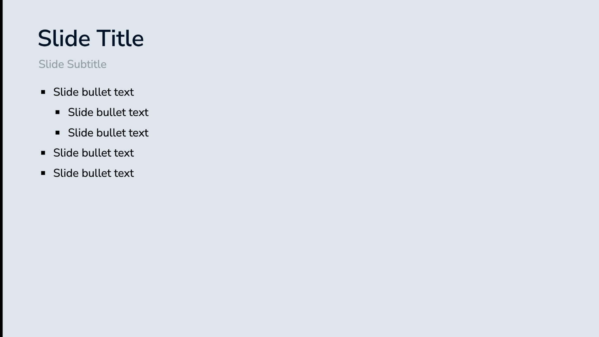
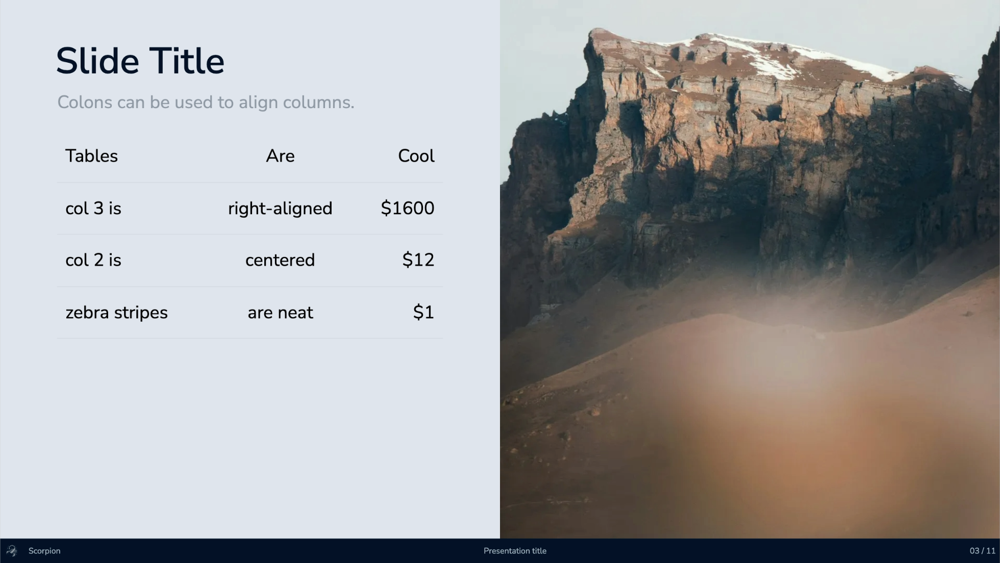
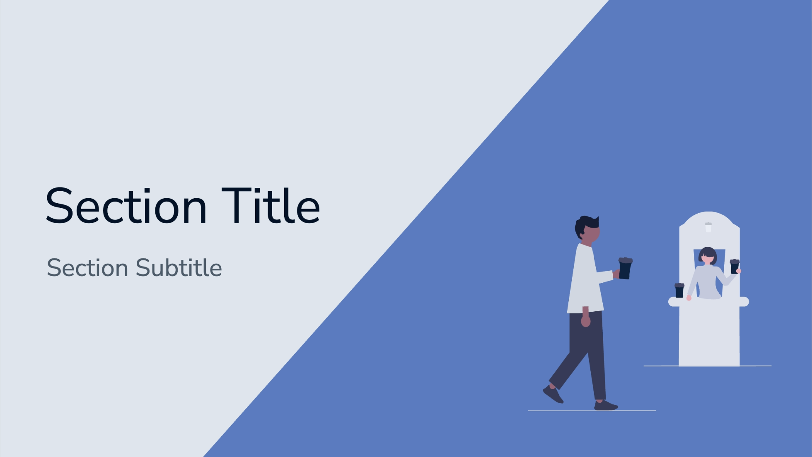
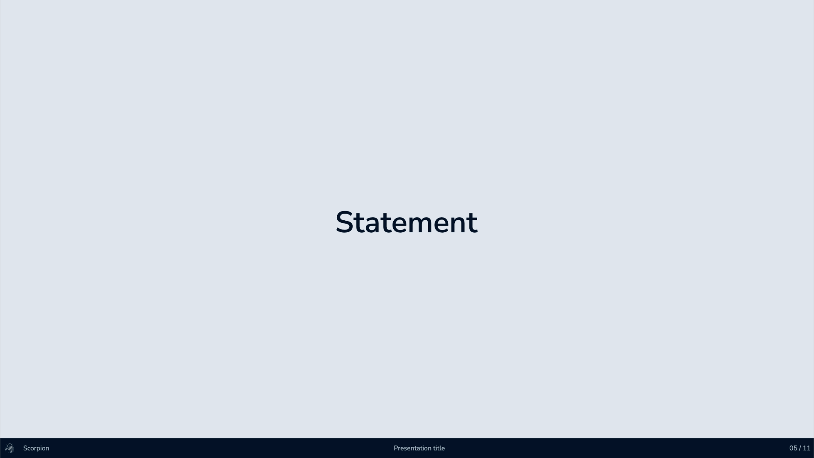
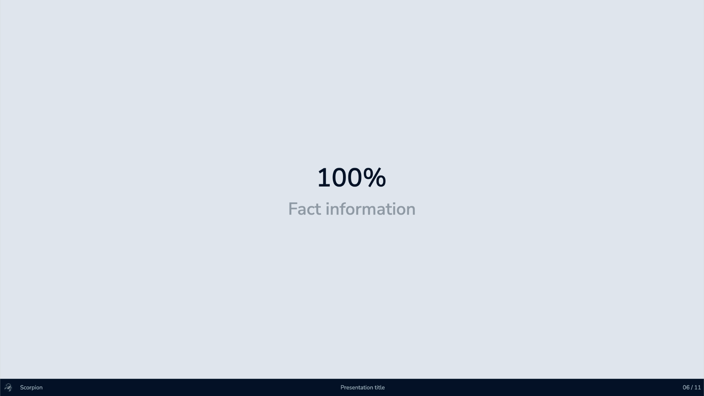
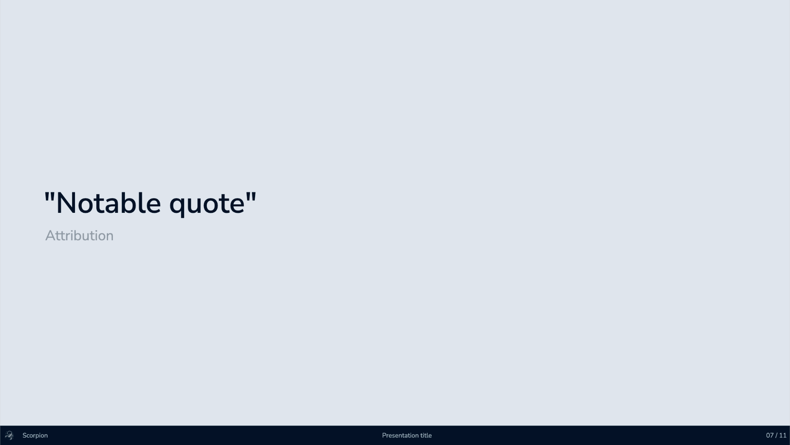
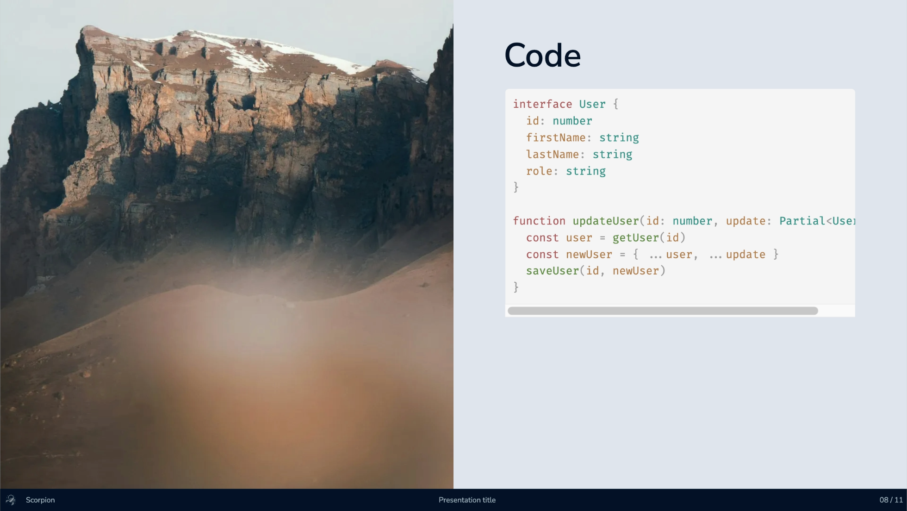
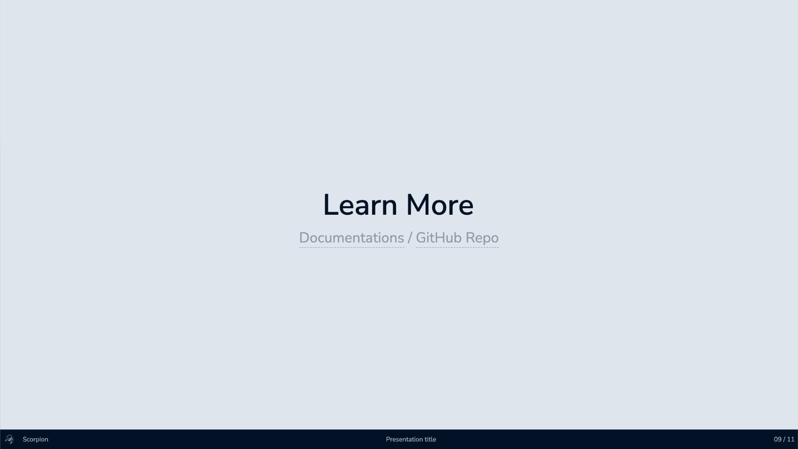
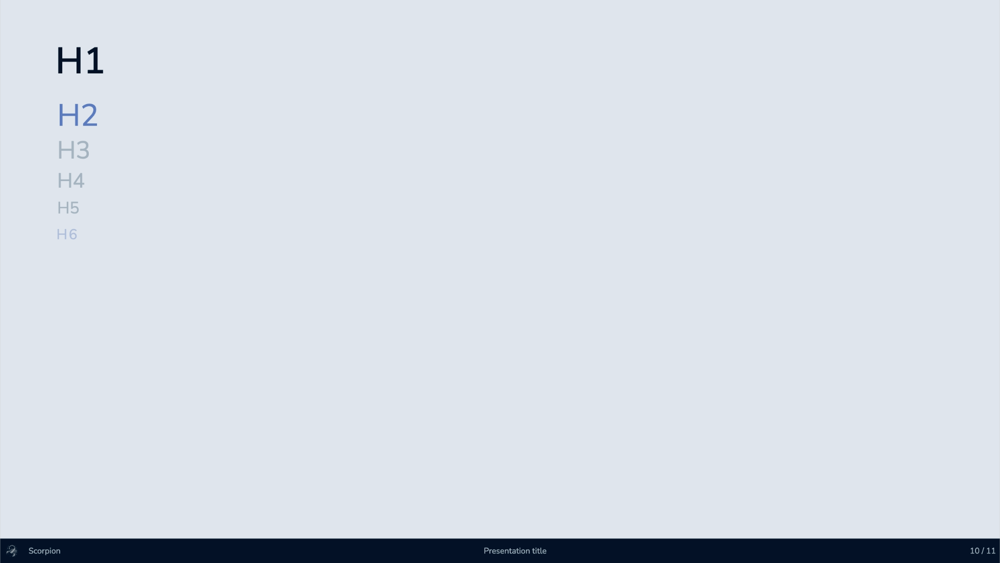
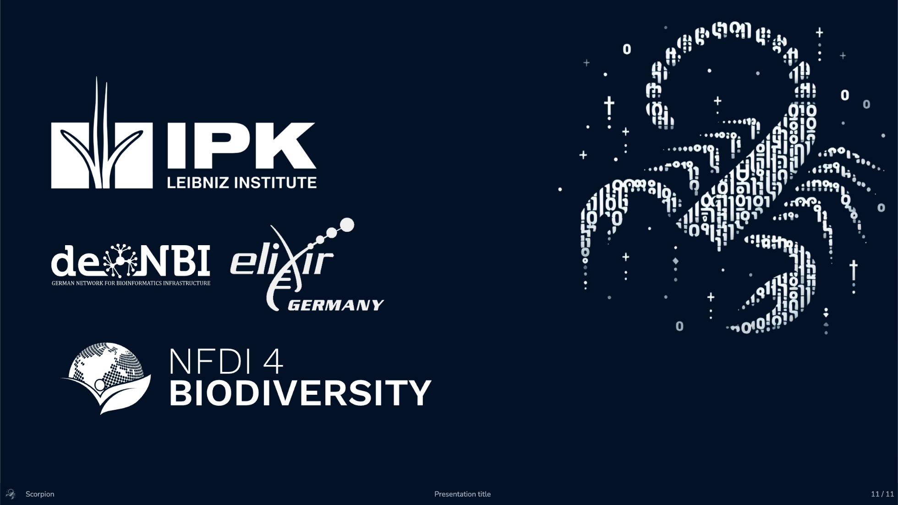

## Install

Add the following frontmatter to your `slides.md`. Start Slidev then it will prompt you to install the theme automatically.

<pre><code>
---
theme: <b>scorpion</b>
---
</code></pre>

Learn more about [how to use a theme](https://sli.dev/guide/theme-addon#use-theme).

## Layouts

This theme provides the following layouts:

- cover
- end
- section

## Components

This theme provides the following components:

- Admonition (adapted from: https://github.com/gureckis/slidev-theme-neversink/blob/main/components/Admonition.vue)
- AdmonitionType (adapted from: https://github.com/gureckis/slidev-theme-neversink/blob/main/components/AdmonitionType.vue)

## Contributing

- `npm install`
- `npm run dev` to start theme preview of `example.md`
- Edit the `example.md` and style to see the changes
- `npm run export` to generate the preview PDF
- `npm run screenshot` to generate the preview PNG
